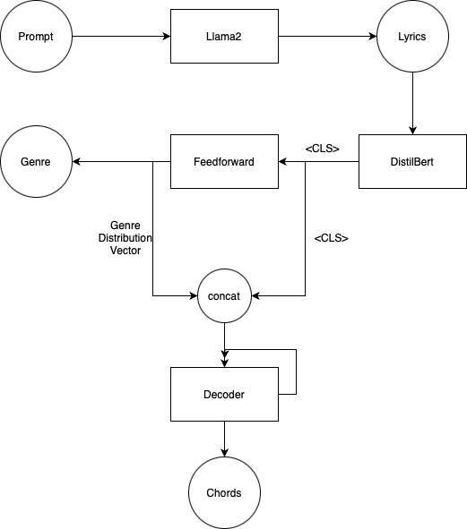
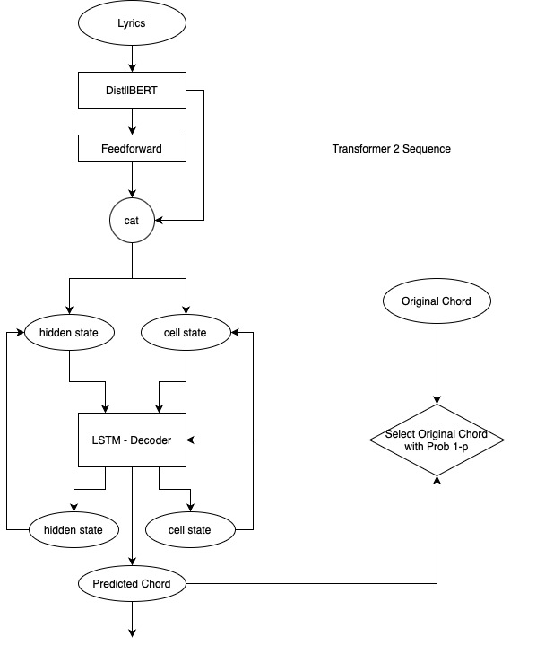
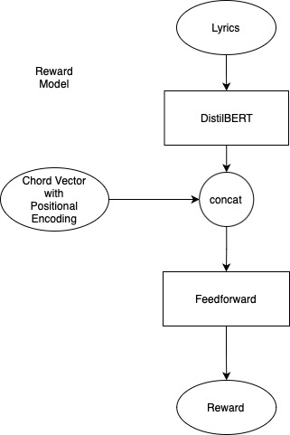
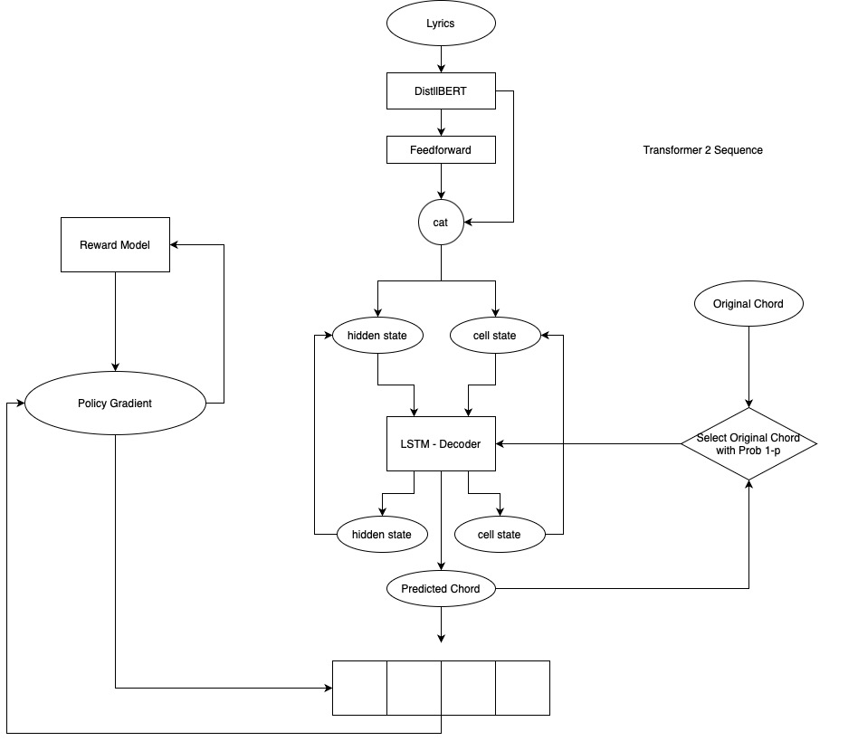

# Prompt-to-Song Generation using Large Language Models

This project explores the use of large language models (LLMs) to generate complete musical compositions from high-level textual descriptions. The process involves understanding the semantics of the prompt, generating relevant lyrics, identifying the musical genre, and composing melodic and harmonic elements to create the final song. This methodology leverages the capabilities of LLMs for generating songs conditioned on textual prompts through a multi-stage process.

## Methodology

Our approach is divided into three main stages:

1. **Lyric Generation from Textual Prompts**
2. **Genre Classification of the Lyrics**
3. **Chord Progression Generation Conditioned on Lyrics and Genre**

### 1. Lyric Generation from Textual Prompts

We use fine-tuned LLMs, specifically FlanT5 and Llama models, for generating lyrics from textual prompts. The prompts are encoded using the LLM's tokenizer and input to the decoder model, which generates the lyrics token-by-token. We fine-tune the LLM for three epochs on a lyrics-prompt dataset using the LLama Factory Library.

#### Prompt Structure:
- **Title:** Provide a title or theme for the song.
- **Artist or Band Name:** Specify the name of the artist or band (real or fictional).
- **Genre:** Specify the primary musical genre or style.
- **Sub-genres:** List any relevant sub-genres or related styles.
- **Era or Decade:** Indicate the era or decade influencing the song’s style.

### 2. Genre Classification of the Lyrics

To classify the genre of the generated lyrics, we compare several pre-trained models, including BERT, DistilBERT, and RoBERTa fine-tuned for genre classification.

### 3. Chord Progression Generation Conditioned on Lyrics and Genre

Generating chord progressions involves understanding the semantic and structural relationship between lyrics and chords. We explore two approaches:

#### Transformer-to-Sequence Model

- **Architecture:** A two-stage encoder-decoder model with a frozen DistilBERT encoder generating lyric embeddings and an LSTM decoder predicting chord progressions step-by-step.
- **Training:** Teacher forcing is employed, where the true chord is fed back into the system with a certain probability during training.

#### Reinforcement Learning with Human Feedback (RLHF)

- **Framework:** The task is formulated as a sequential decision-making problem, solved using reinforcement learning.
- **Reward Model:** Trains a Reward Model that quantifies the goodness of the chord selected.

- **Policy Network:** Trains a policy network to select chords based on lyrical context, optimized using human feedback encoded in a reward model.
- **Positional Encoding:** Enhances the model's understanding of chord order by adding positional information to one-hot chord representations.
- **Training:** Uses policy gradient methods to maximize the expected reward for chord-lyric compatibility.

By combining memory-based LSTMs with the contextual strengths of Transformers and leveraging reinforcement learning techniques, our approach offers a comprehensive solution for generating musically coherent chord progressions from textual descriptions.

### Conclusion

This methodology demonstrates the potential of LLMs in generating complete musical compositions from high-level textual prompts, addressing the complexities of lyric generation, genre classification, and chord progression prediction through advanced machine learning techniques.

## How to Run

### Lyric Generation from the textual prompt
1. Go to Generation.ipynb file, where we have used LLama Factory code to finetune the LLM
2. Also inthe file is the code to generate dataset, and code to create music samples as per AudioGen, Song composer and Music Gen.

### Genre Classification of Lyrics
1. Go to 'genre_classifier' folder
2. Run the following command: python3 trainer.py --transformer_name distilbert-base-uncased --tokenizer_name distilbert-base-uncased --freeze_transformer True --batch_size 128 --learning_rate 3e-4 --epochs 100
3. It will generate model for every epoch in models folder. Keep which you felt have good accuracy and delete rest.

### Chord Progression Conditoned on the Lyrics and Genre

#### Transformer-2-Sequence
1. Go to 'transformer_2_sequence' folder
2. Copy model saved in 'genre_classifier' folder to 'artifacts' in the current path and rename it to 'encoder.pth'
3. Run the following command: python3 trainer.py --batch_size 128 --learning_rate 3e-4 --epochs 50
4. It will generate model for every epoch in models folder. Keep which you felt have good accuracy and delete rest.

#### RHLF

##### Reward Model
1. Go to 'rhlf/reward_model' folder
2. Run the following command: python3 trainer.py --batch_size 128 --learning_rate 3e-4 --epochs 50
3. It will generate model for every epoch in models folder. Keep which you felt have good accuracy and delete rest.

##### Reinforcement using Policy Gradient
1. Go to 'rhlf/policy_gradient' folder
2. Copy model saved in 'genre_classifier' folder to 'artifacts' in the current path and rename it to 'encoder.pth'
3. Copy model saved in 'rhlf/reward_model' folder to 'artifacts' in the current path and rename it to 'reward_model.pth'
4. python3 trainer.py --batch_size 128 --learning_rate 3e-4 --epochs 50
5. It will generate model for every epoch in models folder. Keep which you felt have good accuracy and delete rest.

### Final Pipeline
1. Go to 'pipeline' folder
2. Copy model saved in 'genre_classifier' folder to 'artifacts' in the current path and rename it to 'encoder.pth'
3. Copy model saved in 'transformer_2_sequence' folder to 'artifacts' in the current path and rename it to 'decoder_tf_2_seq.pth'
4. Copy model saved in 'rhlf/policy_gradient' folder to 'artifacts' in the current path and rename it to 'decoder_rhlf.pth'
5. Got to 'input.ipynb' notebook and play accordingly
